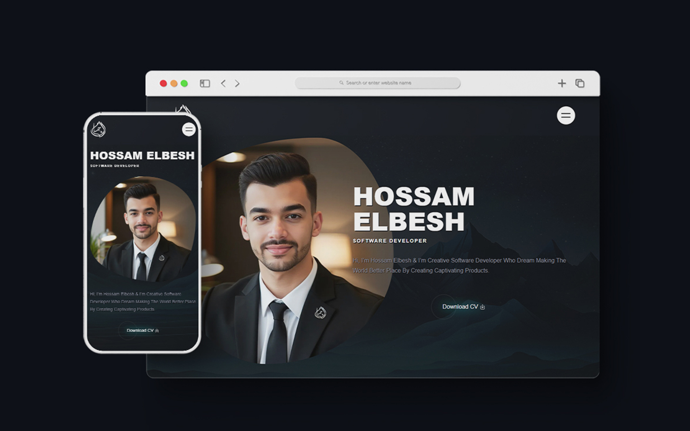

# Personal Portfolio Website



## Features

- **Responsive Design**: The website is fully responsive, providing a seamless experience on all devices (desktops, tablets, and mobile phones).
- **Portfolio**: Displays a collection of my projects, including designs and apps that I have worked on.
- **Contact Section**: Allows users to connect with me via email or social media links.

## Technologies Used

- **HTML**: Structuring the website content.
- **CSS**: Styling the layout and visual elements.
- **JavaScript**: Adding interactivity and dynamic content.
- **GitHub Pages**: Hosting the website.

## Installation & Usage

To run the website locally:

1. Clone the repository:
    ```bash
    git clone https://github.com/HossamElbesh/HossamElbesh.github.io.git
    ```
2. Open the `index.html` file in your browser to view the website.

Alternatively, visit the live website at:
[https://hossamelbesh.github.io/](https://hossamelbesh.github.io/)
